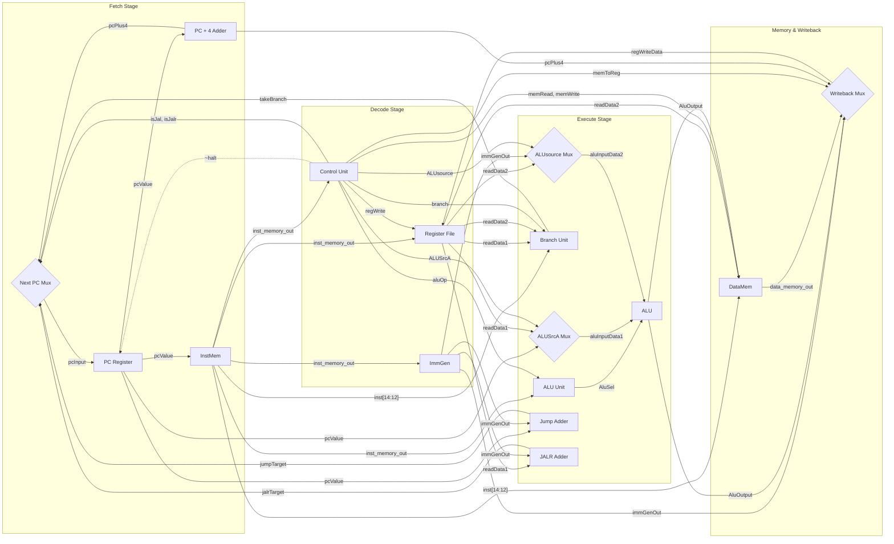

```mermaid
flowchart LR
    %% Subgraphs for visual grouping
    subgraph Fetch Stage
        PC_MUX{Next PC Mux}
        PC[PC Register]
        PC_ADD[PC + 4 Adder]
        IM[InstMem]
    end

    subgraph Decode Stage
        CTRL[Control Unit]
        REG[Register File]
        IMM[ImmGen]
    end

    subgraph Execute Stage
        ALU_CTRL[ALU Unit]
        BR_UNIT[Branch Unit]
        MUX_A{ALUSrcA Mux}
        MUX_B{ALUsource Mux}
        ALU[ALU]
        JMP_ADD[Jump Adder]
        JALR_ADD[JALR Adder]
    end

    subgraph Memory & Writeback
        DM[DataMem]
        WB_MUX{Writeback Mux}
    end

    %% Routing PC & Fetch
    PC_MUX -->|pcInput| PC
    PC -->|pcValue| IM
    PC -->|pcValue| PC_ADD
    PC -->|pcValue| MUX_A
    PC -->|pcValue| JMP_ADD
    CTRL -.->|"~halt"| PC

    %% Routing Decode
    IM -->|inst_memory_out| CTRL
    IM -->|inst_memory_out| REG
    IM -->|inst_memory_out| IMM
    IM -->|inst_memory_out| ALU_CTRL
    IM -->|"inst[14:12]"| BR_UNIT
    IM -->|"inst[14:12]"| DM

    %% Routing Register File
    CTRL -->|regWrite| REG
    WB_MUX -->|regWriteData| REG
    REG -->|readData1| MUX_A
    REG -->|readData1| BR_UNIT
    REG -->|readData1| JALR_ADD
    REG -->|readData2| MUX_B
    REG -->|readData2| BR_UNIT
    REG -->|readData2| DM

    %% Routing ImmGen
    IMM -->|immGenOut| MUX_B
    IMM -->|immGenOut| JMP_ADD
    IMM -->|immGenOut| JALR_ADD
    IMM -->|immGenOut| WB_MUX

    %% Routing ALU & Control
    CTRL -->|ALUSrcA| MUX_A
    CTRL -->|ALUsource| MUX_B
    CTRL -->|aluOp| ALU_CTRL
    CTRL -->|branch| BR_UNIT
    ALU_CTRL -->|AluSel| ALU
    MUX_A -->|aluInputData1| ALU
    MUX_B -->|aluInputData2| ALU

    %% Routing Data Memory
    CTRL -->|"memRead, memWrite"| DM
    ALU -->|AluOutput| DM
    ALU -->|AluOutput| WB_MUX
    DM -->|data_memory_out| WB_MUX

    %% Routing Writeback
    CTRL -->|memToReg| WB_MUX
    PC_ADD -->|pcPlus4| WB_MUX

    %% Routing Next PC
    CTRL -->|"isJal, isJalr"| PC_MUX
    BR_UNIT -->|takeBranch| PC_MUX
    PC_ADD -->|pcPlus4| PC_MUX
    JMP_ADD -->|jumpTarget| PC_MUX
    JALR_ADD -->|jalrTarget| PC_MUX
```
